# UniverSys Lite

A comprehensive university management system built with .NET 8 and Angular 19. This full-stack application provides a modern, intuitive interface for managing students, courses, enrollments, grades, billing, and facility scheduling.

## Features

- **Student Management** - Complete student lifecycle management with academic tracking
- **Course Catalog** - Manage courses, prerequisites, and sections
- **Enrollment System** - Student course registration and enrollment tracking
- **Grade Management** - Grade entry, transcripts, and GPA calculations
- **Billing & Payments** - Tuition charges, payments, and financial holds
- **Room Scheduling** - Building and room management with scheduling
- **Notifications** - Real-time notification system with preferences
- **Role-Based Access** - Secure authentication with role-based permissions

## Tech Stack

### Backend
- .NET 8 Web API
- Entity Framework Core
- SQL Server
- JWT Authentication
- Clean Architecture (Domain, Application, Infrastructure, Presentation)

### Frontend
- Angular 19
- Angular Material
- TailwindCSS
- RxJS
- ngx-charts

## Screenshots

### Login
Modern login interface with university branding and secure authentication.


### Dashboard
Admin dashboard with key metrics, charts, and quick actions.

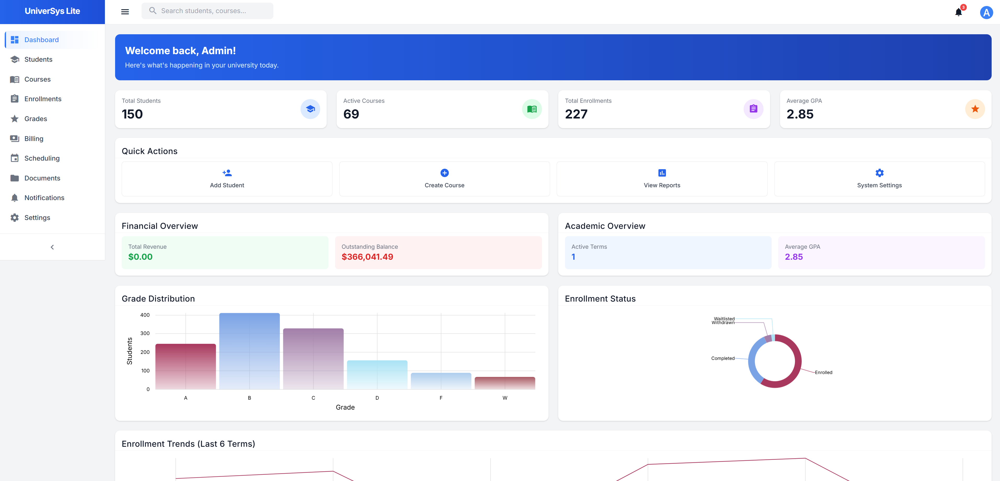

### Student Management
Comprehensive student list with search, filters, and status indicators.

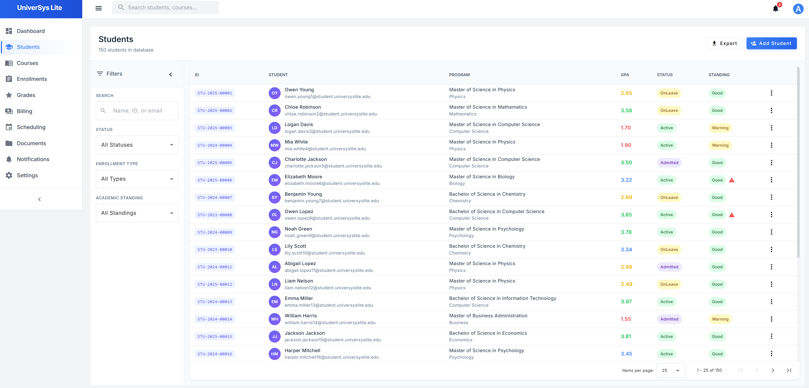

### Student Profile
Detailed student view with personal, academic, and financial information.

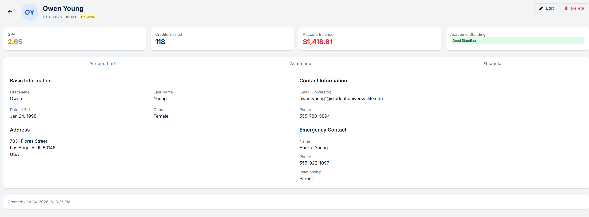

### Edit Student
Full-featured student edit form with validation.


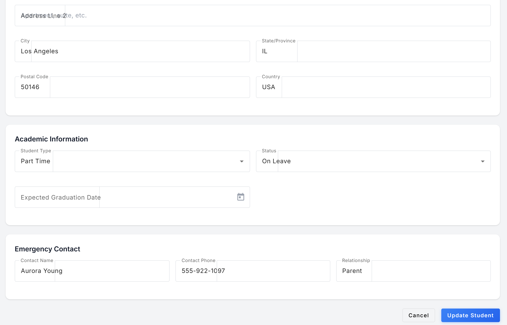

### Course Catalog
Browse and manage courses with filtering by department, level, and credits.

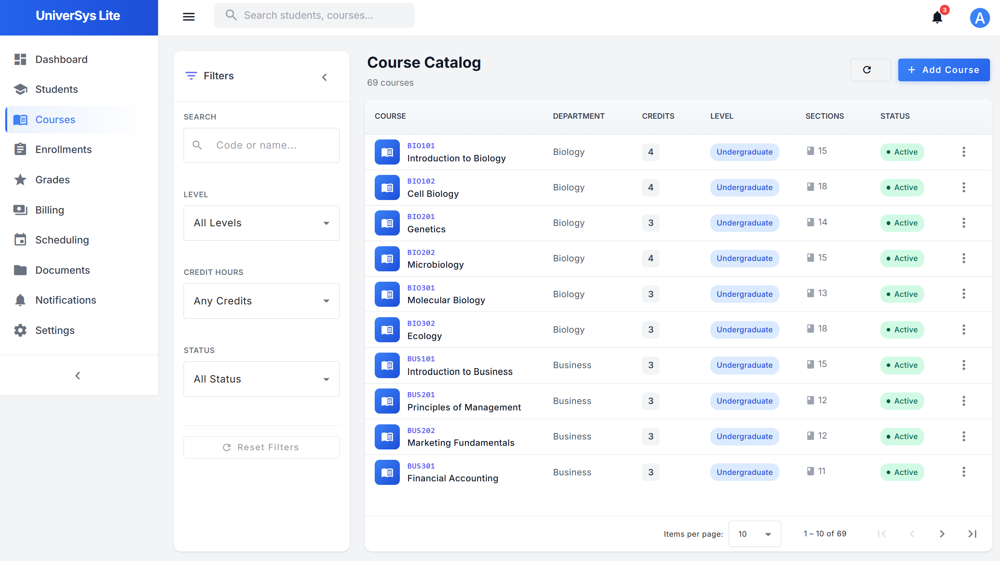

### Course Details
Detailed course view with prerequisites and section information.

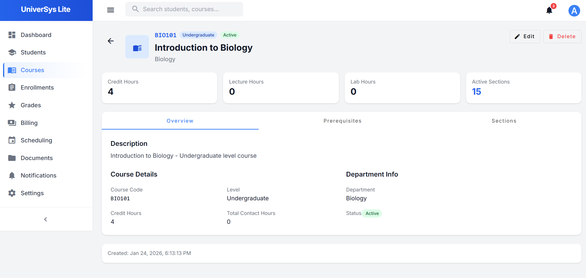

### Enrollments
Track student enrollments with grades and completion status.


### Enrollment Details
Individual enrollment view with student and course information.

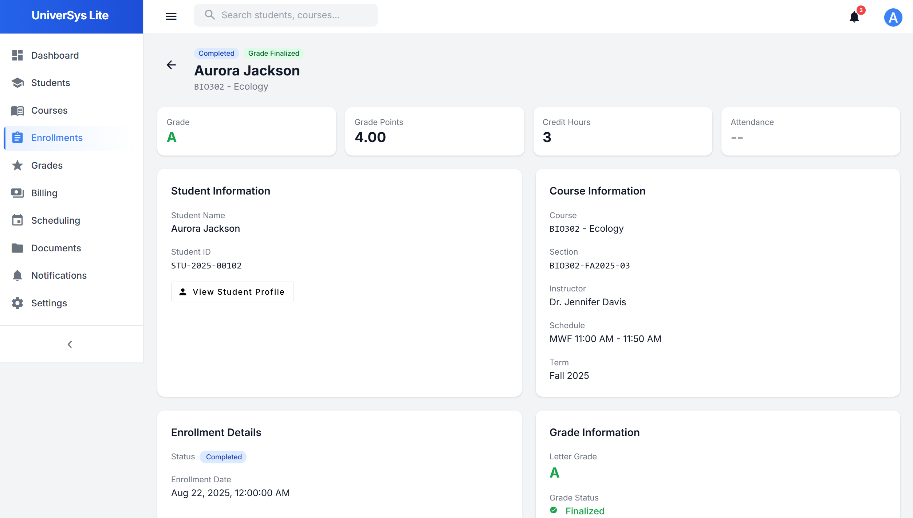

### Grade Management
Section-based grade entry with grade distribution overview.

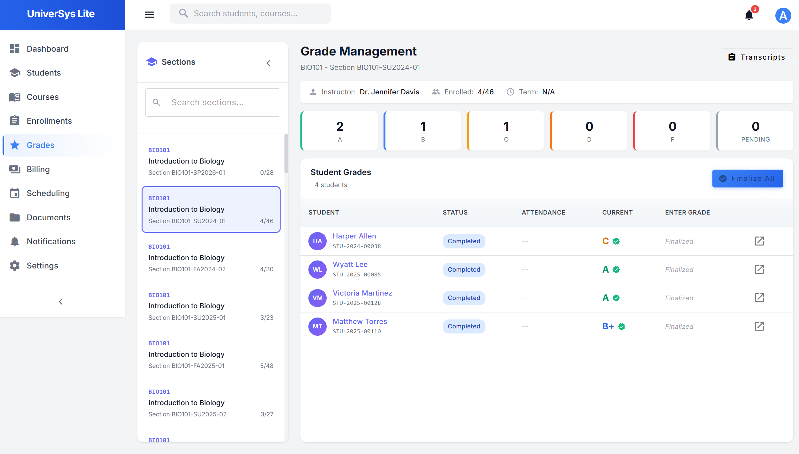

### Billing Management
Student billing with charges, payments, and account balance tracking.

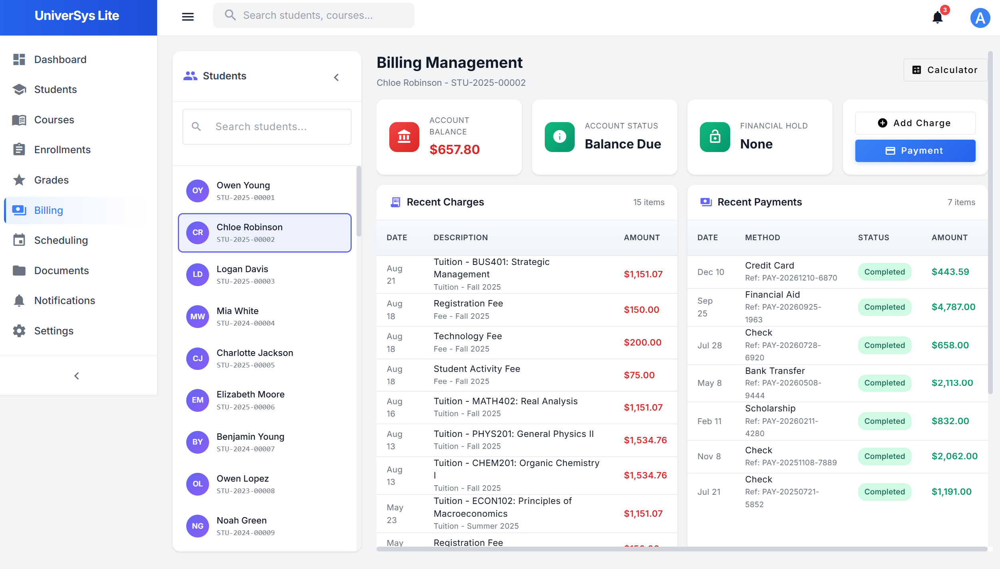

### Settings & Profile
User profile management with account settings.

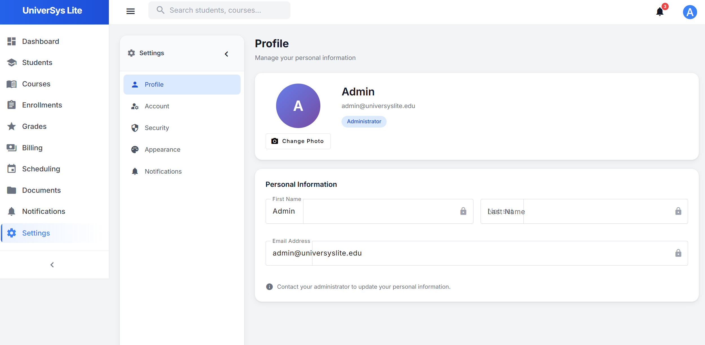

### Room Management
Manage rooms across campus buildings with capacity and features.

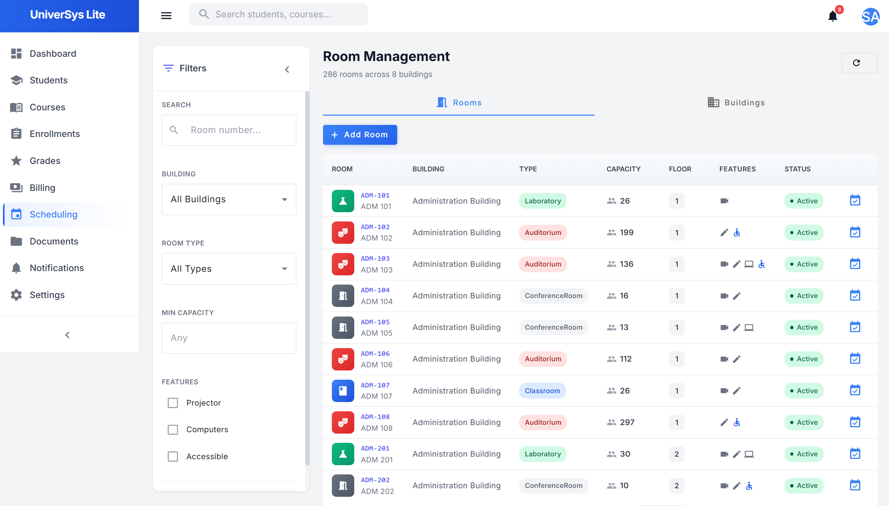

### Building Management
Campus buildings overview with room counts and floor information.

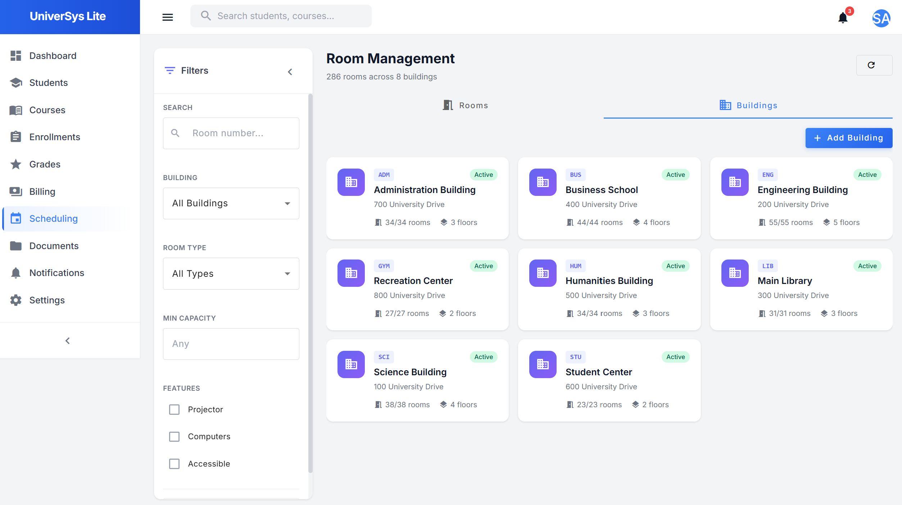

### Notification Center
Real-time notifications with filtering and quick actions.

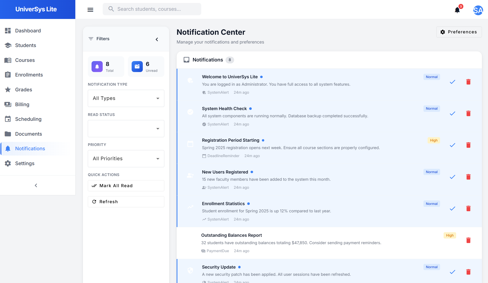

### Notification Preferences
Granular notification preferences for email, push, and in-app alerts.

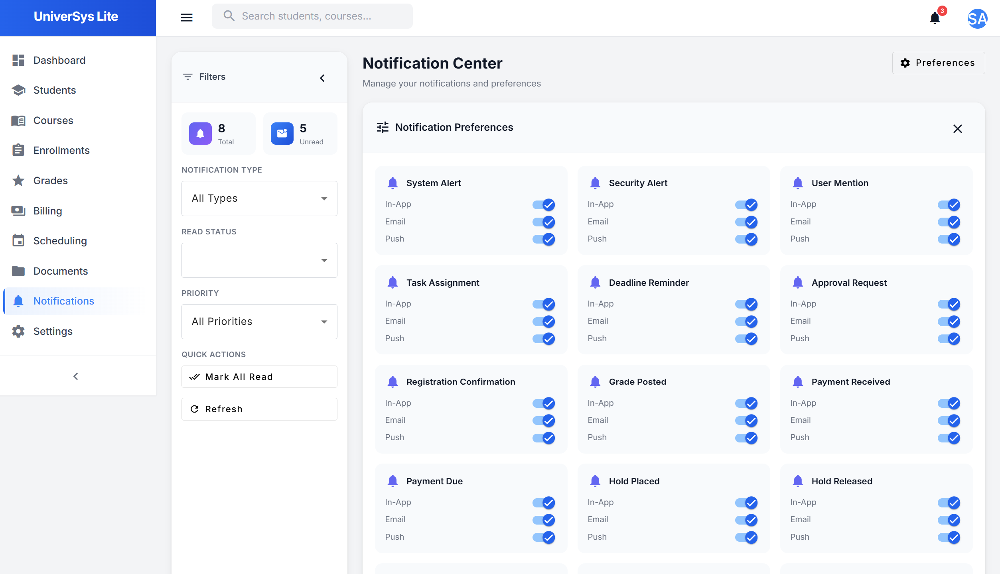

## Getting Started

### Prerequisites
- .NET 8 SDK
- Node.js 18+
- SQL Server (LocalDB or full instance)

### Backend Setup

```bash
cd src/Presentation/UniverSysLite.API
dotnet restore
dotnet run
```

The API will start at `http://localhost:5275`

### Frontend Setup

```bash
cd frontend
npm install
npm start
```

The application will be available at `http://localhost:4200`

### Default Credentials

| Role | Email | Password |
|------|-------|----------|
| Admin | admin@universyslite.edu | Admin@123! |

## Project Structure

```
UniverSysLite/
├── src/
│   ├── Core/
│   │   ├── UniverSysLite.Domain/        # Entities, enums, interfaces
│   │   └── UniverSysLite.Application/   # Use cases, DTOs, services
│   ├── Infrastructure/
│   │   └── UniverSysLite.Infrastructure/ # EF Core, repositories, external services
│   └── Presentation/
│       └── UniverSysLite.API/           # Controllers, middleware
├── frontend/                             # Angular application
│   └── src/app/
│       ├── core/                        # Auth, interceptors, services
│       └── features/                    # Feature modules
└── screenshots/                          # Application screenshots
```

## API Documentation

Swagger documentation is available at `http://localhost:5275/swagger` when running in development mode.

## License

This project is for demonstration and portfolio purposes.
